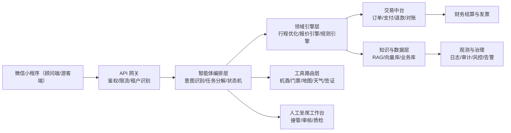

# 商业可用旅游规划智能体方案（旅行社 SaaS 版）

**版本**: v1.0  
**日期**: 2026-02-12  
**适用背景**: 大型旅行公司内部技术团队，建设面向公司业务与合作旅行社的智能体能力

## 1. 已敲定的业务决策

1. 目标客户：旅行社 SaaS（B2B2C）
2. 首发渠道：微信小程序
3. 首发区域：国内游
4. 商业模式：SaaS 收费
5. 成交方式：自建支付闭环
6. 服务策略：上线初期开启人工兜底

## 2. 业务目标与边界

### 2.1 核心目标
- 帮助门店顾问/运营快速生成可售卖行程方案，缩短成单周期
- 在可控成本下提升转化率、客单价与复购
- 打通“规划-报价-下单-支付-履约-售后”闭环，沉淀标准化能力为 SaaS 产品

### 2.2 V1 业务边界（建议）
- 支持国内自由行和半自由行，不覆盖复杂国际联程
- 支持单用户会话决策，不做多人实时协同编辑
- 支持标准订单流程，不覆盖全部特批财务流程

## 3. 总体架构

## 4. 分层设计（可落地）

### 4.1 接入层（Channel + Gateway）
- 微信小程序：游客侧会话、顾问侧运营
- API 网关：JWT/OAuth、租户识别、流量治理、灰度策略
- 会话管理：用户 ID、会话 ID、租户 ID、请求追踪 ID 全链路透传

### 4.2 智能体编排层（Agent Orchestrator）
- 意图识别：目的地咨询、行程规划、预算优化、改期改线、售后问题
- 任务分解：交通、酒店、景点、用餐、预算、政策风险
- 对话状态机：缺失信息追问、方案确认、支付引导、人工转接
- 工具调用策略：优先结构化接口，LLM 仅做解释与生成，关键决策走规则/算法

### 4.3 旅游领域引擎层（Domain Engine）
- 行程生成器：按天生成景点/交通/餐饮建议，含时间窗与地理距离约束
- 约束优化器：预算、出发地、老人/亲子偏好、交通时间、营业时间
- 报价引擎：打包组合（机+酒+门票+地接），支持毛利率与渠道价策略
- 规则引擎：退改签规则、节假日拥堵、天气预警、景区限流

### 4.4 交易中台（Commerce Core）
- 订单中心：草单、确认单、支付单、履约单、售后单
- 支付闭环：收银台、支付网关、异步回调、幂等、分账与退款
- 财务能力：对账、发票、渠道结算、异常单处理

### 4.5 数据与知识层（Data + Knowledge）
- 结构化数据：产品库、价格库存、订单、用户画像、租户配置
- 非结构化知识：目的地攻略、常见问答、政策文档、服务规范
- 检索方案：向量检索 + 规则过滤 + 结构化查数（避免幻觉）
- 数据隔离：按租户逻辑隔离，关键表支持物理隔离扩展

### 4.6 人工兜底与运营层（HITL）
- 坐席接管：低置信度会话、投诉风险会话、支付异常会话自动转人工
- 审核机制：高价值订单人工确认
- 质检闭环：会话质检打分反哺提示词与规则策略

### 4.7 治理与合规层（Enterprise Readiness）
- 安全：PII 脱敏、字段级权限、接口签名、防重放
- 合规：隐私合规、日志审计、数据生命周期管理
- 可观测：QPS、时延、失败率、成本、转人工率、成单率
- 稳定性：熔断、重试、降级、缓存、多活容灾策略

## 5. SaaS 多租户架构（旅行社场景关键）

### 5.1 租户模型
- 平台租户（总部）
- 子租户（分子公司/加盟门店）
- 角色体系（总部运营、门店顾问、客服、财务、审计）

### 5.2 隔离策略
- 身份隔离：租户级 RBAC + 数据权限域
- 数据隔离：租户字段隔离 + 高等级客户可选独立库
- 配置隔离：品牌、模板、报价策略、支付参数可按租户覆盖

### 5.3 可运营性
- 租户开通模板（默认知识库、默认流程、默认价格策略）
- 配置中心（提示词模板、规则参数、套餐模板）
- 计费中心（按席位/按调用量/按成交额抽成组合）

## 6. 核心流程（端到端）

1. 用户/顾问在小程序输入需求（人数、预算、时间、偏好）
2. 编排层触发任务分解并补齐缺失参数
3. 领域引擎生成 2-3 套可售方案（含预算明细与风险提醒）
4. 用户确认后进入订单与支付闭环
5. 成交后输出行前清单与履约提醒
6. 低置信度或异常流程自动转人工坐席处理

## 7. 技术选型建议（V1）

### 7.1 后端与基础设施
- 网关：Kong / APISIX
- 服务：Java/Spring Boot 或 Go（按现有技术栈）
- 消息队列：Kafka / RocketMQ
- 缓存：Redis
- 数据库：MySQL + Elasticsearch（检索）+ 向量库（Milvus/pgvector）

### 7.2 智能体与算法
- LLM 路由：高复杂度请求走大模型，常规请求走轻量模型
- 编排框架：自研编排 + 工作流引擎（Temporal/自研状态机）
- 优化算法：规则 + 约束求解（避免纯生成不稳定）

### 7.3 质量保障
- Prompt/工具调用回归集
- 关键流程 E2E 自动化测试
- A/B 实验平台（比较转化率、客诉率、转人工率）

## 8. KPI 与验收口径（商业可用）

- 成单转化率提升：>= 15%
- 顾问产能提升：单人日产出方案数 >= 30%
- 人工转接率：首月 < 35%，三个月 < 20%
- 支付成功率：>= 99.5%
- 核心链路可用性：>= 99.9%
- 单次规划平均响应：P95 < 4 秒（不含外部慢接口）

## 9. 分阶段实施计划

### Phase 1（0-8 周）：MVP 上线
- 小程序接入、基础会话、行程生成、报价展示
- 自建支付闭环最小能力（下单、支付、退款）
- 人工坐席接管与基础监控告警

### Phase 2（9-16 周）：业务增强
- 多租户配置中心、计费中心
- 行程优化算法升级、报价策略分层
- 售后自动化与知识库迭代闭环

### Phase 3（17-24 周）：规模化运营
- 多区域扩展、更多供应商接入
- 精细化运营（人群分层推荐）
- 全链路成本优化与高可用升级

## 10. 主要风险与对策

- 供应商接口波动：做缓存、降级与多供应商路由
- 价格/库存不一致：下单前二次确认 + 幂等校验
- 大模型不稳定：关键决策规则化，低置信度转人工
- SaaS 交付复杂度高：优先模板化开通与标准实施包

## 11. 最终方案结论

本方案以“旅行社 SaaS + 微信小程序 + 国内游 + SaaS 收费 + 自建支付闭环 + 初期人工兜底”为核心，强调多租户可运营、交易闭环可控、企业级治理可审计。  
该架构可先支撑公司内部业务提效，再标准化输出给合作旅行社，实现从内部能力平台到对外 SaaS 商业化的连续演进。
